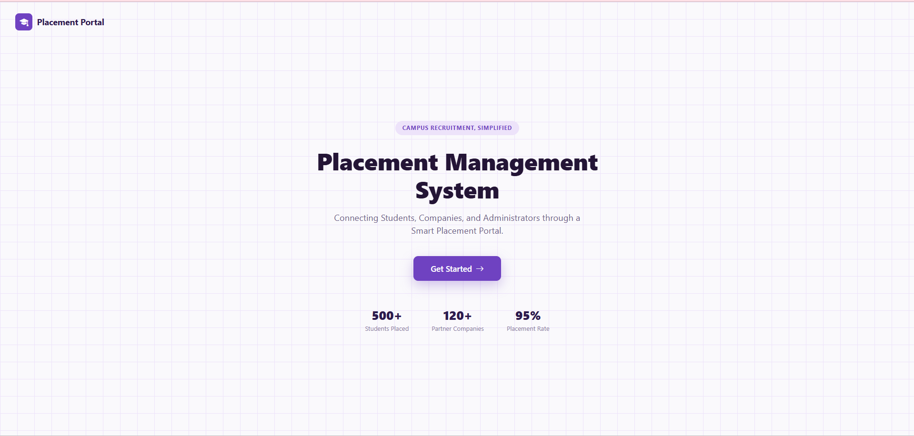
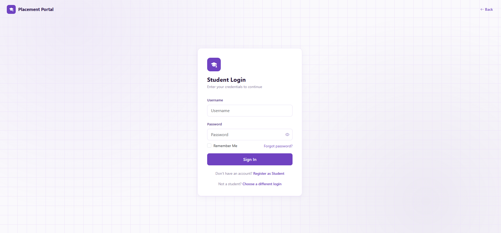
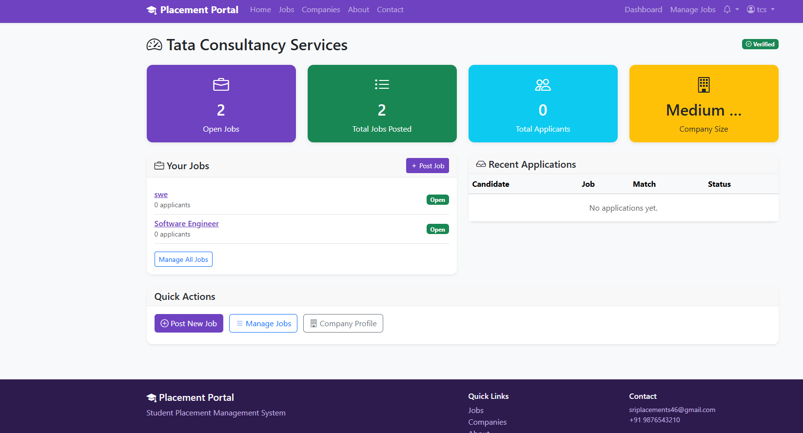

# 🎓 Student Placement Management System

A full-stack web application for managing campus placements — student profiles, job postings, applications, interviews, and placement drives — built with role-based access control, smart resume matching, and a clean, modern UI.

🔗 **Live Demo:** [student-placement-system-5xt4.onrender.com](https://student-placement-system-5xt4.onrender.com)

## 📸 Screenshots

### Landing Page


### Role Selection


### Student Login


### Student Dashboard


### Company Dashboard


### Placementofficer Dashboard


### Admin Dashboard

## ✨ Features

🔐 **Secure Authentication** — Django session-based login/register, with dedicated login pages per role (Student, Company, Admin) that reject mismatched account types
👥 **Role-Based Access** — separate dashboards and permissions for Students, Companies, Placement Officers, and Admins
🚪 **Guided Auth Flow** — landing page → role selection → dedicated login per role → correct dashboard, with animated transitions
📝 **Job Postings & Applications** — companies post jobs with eligibility criteria (CGPA, department, skills); students apply and track status
🧠 **Smart Resume Match System** — extracts text from uploaded PDF resumes, compares required skills against the job, and shows match %, missing skills, and suggested skills to learn — built entirely with Python (PyPDF2 + custom matching logic), no external AI API
🏢 **Placement Drives** — schedule drives, assign interview slots, issue offer letters (PDF via ReportLab)
📊 **Dashboard & Analytics** — real-time placement statistics with Chart.js, department-wise breakdowns
🔔 **Notifications** — students notified on application status changes
📑 **Reports & CSV Export** — placement officers generate and export reports
📧 **Contact Form** — messages routed through Formspree (avoids SMTP port restrictions on free hosting tiers)
🎨 **Modern UI** — clean, responsive design with a consistent purple theme across dashboards and auth pages

## 🛠️ Tech Stack

**Backend:** Python, Django 5
**Frontend:** Django Templates, Bootstrap 5, Chart.js
**Database:** PostgreSQL (production, via Render) / SQLite (local dev)
**Resume Parsing:** PyPDF2
**PDF Generation:** ReportLab
**Static Files:** WhiteNoise
**Deployment:**
- App + Database: Render (Blueprint via `render.yaml`)
- Contact form delivery: Formspree

## 👥 User Roles

| Role | Access |
|---|---|
| **Student** | Build profile, upload resume, view eligible jobs, apply, track applications & interviews, download offer letters |
| **Company** | Register, post jobs, set eligibility criteria, view applicants, shortlist, schedule interviews, issue offers |
| **Placement Officer** | Verify student/company profiles, manage drives, generate & export reports, view analytics |
| **Admin** | Manage users, departments, announcements, placement drives, view all reports |

## 🗄️ Database Schema

- **accounts** — `CustomUser` (role-based), `Department`, `Skill`, `Notification`, `Announcement`
- **students** — `StudentProfile`, `Certification`, `Project`, `Resume`
- **companies** — `CompanyProfile`
- **jobs** — `Job` (eligibility, required skills, deadline), `Application` (match %, missing/suggested skills)
- **placement** — `PlacementDrive`, `Interview`, `OfferLetter`

## 🚀 Getting Started Locally

### Prerequisites
- Python 3.10+
- pip

### Setup

```bash
git clone https://github.com/hemasricheparthi/student-placement-system.git
cd student-placement-system

python -m venv venv
venv\Scripts\activate      # Windows
# source venv/bin/activate  # Linux/Mac

pip install -r requirements.txt

python manage.py migrate
python manage.py load_sample_data   # creates demo users, departments, jobs
python manage.py runserver
```

## 🔮 Future Improvements

- Email notifications for application/interview updates
- In-app real-time notification bell
- Advanced analytics (placement trends over time)
- Bulk resume upload and parsing
- Mobile-responsive dashboard refinements

## 👤 Author

Built by **Hemasri Cheparthi, Jaya Hasini Kothapalli, Aswija Devi Adapa** as a portfolio project.
GitHub: [@hemasricheparthi](https://github.com/hemasricheparthi),[@KJH666-star](https://github.com/KJH666-star),[@aswijaadapa](https://github.com/aswijaadapa)
